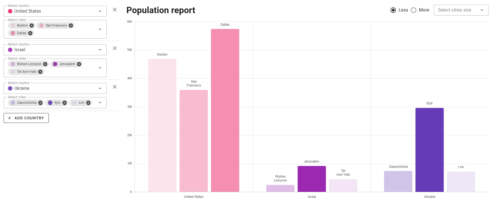

# Population report

[Live site](https://lefrolg.github.io/population-report/)

User-friendly page that allows users to dynamically search and choose cities filtered by countries and be able to see the population data on the bar chart.

## Features

* Left sidebar for selecting multiple countries and their respective cities.
* Dynamic bar chart displaying city populations, grouped by country.
* Filtering options to refine the dataset based on population size.
* Real-time updates to the chart based on user selections and applied filters.
* Caching mechanism to enhance performance and usability.
* Responsive design for optimal viewing across different devices.



## ✨ Tech Stack

- 🖼️ **Optimized Front-End Stack**: Leverage the latest Vue 3 and Vuetify 3 for a modern, reactive UI development experience. [Vue 3](https://v3.vuejs.org/) | [Vuetify 3](https://vuetifyjs.com/en/)
- 🗃️ **State Management**: Integrated with [Pinia](https://pinia.vuejs.org/), the intuitive, modular state management solution for Vue.
- 🚦 **Routing and Layouts**: Utilizes Vue Router for SPA navigation and vite-plugin-vue-layouts for organizing Vue file layouts. [Vue Router](https://router.vuejs.org/) | [vite-plugin-vue-layouts](https://github.com/JohnCampionJr/vite-plugin-vue-layouts)
- 📊 **Data Visualization**: Built-in support for Chart.js with Vue bindings via vue-chartjs to create interactive and visually appealing charts. [Chart.js](https://www.chartjs.org/) | [Vue Chart.js](https://vue-chartjs.org/)
- 🔄 **Data Fetching & Caching**: Uses Axios for efficient API requests, enhanced with axios-cache-interceptor for improved performance and reduced redundant network calls.[Axios](https://axios-http.com/) | [Axios Cache Interceptor](https://axios-cache-interceptor.js.org/)
- ⚡ **Next-Gen Tooling**: Powered by Vite, experience fast cold starts and instant HMR (Hot Module Replacement). [Vite](https://vitejs.dev/)
- 🧩 **Automated Component Importing**: Streamline your workflow with unplugin-vue-components, automatically importing components as you use them. [unplugin-vue-components](https://github.com/antfu/unplugin-vue-components)

These features are curated to provide a seamless development experience from setup to deployment, ensuring that your Vuetify application is both powerful and maintainable.

## Getting Started

1. Clone the repository:

```bash
git clone https://github.com/lefrolg/population-report.git
```

2. Install dependencies:

```bash
npm install
```

3. Start the development server:

```bash
npm run dev
```

4. Build for production:

```bash
npm run build
```

## Project Structure

```
population-report
├── src/
│   ├── assets/            # Static assets
│   ├── components/        # Vue components
│   ├── pages/             # App pages
│   ├── plugins/           # App plugins
│   ├── router/            # App router
│   ├── services/          # App services for Api interaction
│   ├── stores/            # App stores
│   ├── styles/            # Styles
│   ├── utils/             # Helpers
│   └── App.vue            # Root component
├── public/                # Public static assets
├── index.html            # Entry HTML file
└── vite.config.js        # Vite configuration
```
